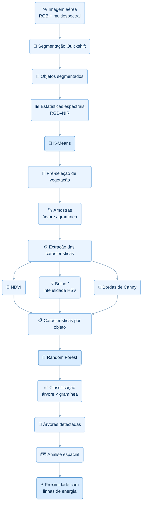

# Combinação de Características de Brilho, Bordas e NDVI para Detecção de Árvores Urbanas e Avaliação de Proximidade com Linhas de Energia

Abordagem orientada a objetos para detecção de árvores urbanas em imagens multiespectrais de alta resolução e análise espacial de proximidade com infraestrutura elétrica.


## Visão geral

A vegetação próxima às redes elétricas aéreas demanda atividades recorrentes de inspeção e manejo, tanto para reduzir interferências na infraestrutura quanto para apoiar o planejamento da arborização urbana. Levantamentos de campo, inspeções aéreas e tecnologias como LiDAR, embora relevantes, podem envolver custos elevados e restrições operacionais.

Este projeto de mestrado investiga uma abordagem baseada em imagens multiespectrais de alta resolução para detectar árvores urbanas e, posteriormente, avaliar sua proximidade com linhas de energia. A metodologia adota análise orientada a objetos, combinando informações espectrais, radiométricas e estruturais com técnicas de aprendizado de máquina.

O README apresenta uma síntese do problema, da proposta metodológica, do estágio atual dos experimentos e da organização necessária para reproduzir a pipeline, sem substituir a documentação científica completa da pesquisa.

## Questão de pesquisa

> A combinação de brilho, densidade de bordas e NDVI em objetos segmentados permite discriminar árvores de gramíneas e, simultaneamente, preservar uma geometria adequada para avaliação de proximidade com linhas de energia?

## Contribuições metodológicas

### 1. Combinação complementar de características

A abordagem utiliza, em nível de objeto:

- 🌿 **NDVI** — informação espectral da vegetação;
- 💡 **brilho HSV** — informação radiométrica;
- ◻️ **bordas de Canny** — informação estrutural e heterogeneidade local.

Não se propõe um novo índice espectral. A contribuição metodológica investigada é a utilização conjunta e interpretável dessas três características para discriminar árvores de gramíneas.

### 2. Estratégia híbrida de classificação

A pipeline combina duas etapas de aprendizado de máquina com funções distintas:

- **K-Means** → pré-seleção de vegetação;
- **Random Forest** → classificação supervisionada entre árvore e gramínea.

Essa integração constitui um dos elementos de originalidade da abordagem, cuja contribuição será avaliada por meio dos experimentos planejados, sem pressupor superioridade em relação a outros métodos.

### 3. Preservação da geometria

Os objetos permanecem representados como polígonos georreferenciados ao longo do processamento. Assim, os mesmos objetos classificados podem ser posteriormente utilizados em:

- cálculo de área;
- proxy de porte;
- interseção espacial;
- análise de distância;
- proximidade com linhas de energia.

A preservação da geometria é uma contribuição metodológica investigada por conectar a etapa de classificação à análise espacial da infraestrutura elétrica.

## Fluxo metodológico



## Resultados atuais

> **Resultados do experimento inicial atualmente documentado.**

| Indicador | Resultado |
| --- | ---: |
| Objetos rotulados | 133 |
| Treinamento | 106 |
| Teste | 27 |
| Acurácia global | **0,81** |

| Classe | Precisão | Recall | F1-score |
| --- | ---: | ---: | ---: |
| Árvores | 0,83 | 0,77 | 0,80 |
| Gramíneas | 0,80 | 0,86 | 0,83 |

A segmentação inicial produziu **15.633 objetos**, dos quais **3.002** foram identificados como candidatos de vegetação na cena analisada.

> **Escopo dos resultados:** os experimentos de ablação, comparação RGB–NIR, SVM e validação cruzada estratificada ainda estão planejados ou em execução e, portanto, não são apresentados como resultados concluídos.

## Tecnologias

| Área | Tecnologias |
| --- | --- |
| Linguagem | Python |
| Execução | Google Colab |
| Rasters | Rasterio |
| Dados vetoriais | GeoPandas, Shapely |
| Processamento | NumPy, Pandas |
| Imagens | scikit-image |
| Machine Learning | scikit-learn |
| Visualização | Matplotlib, Seaborn |
| Versionamento | GitHub + Codex |
| Dados pesados | Google Drive |

As dependências necessárias para executar o projeto estão registradas em [`requirements-colab.txt`](requirements-colab.txt).

## Estrutura do projeto

| Item | Finalidade |
| --- | --- |
| 📓 [`Segmentacao_classificacao.ipynb`](Segmentacao_classificacao.ipynb) | Notebook principal da metodologia |
| 📦 [`requirements-colab.txt`](requirements-colab.txt) | Dependências do ambiente |
| 📘 `README.md` | Documentação principal |
| 🚫 `.gitignore` | Arquivos não versionados |
| 📂 [`data/README.md`](data/README.md) | Orientações sobre os dados |

O GitHub armazena o código e a documentação do projeto. Os dados geoespaciais pesados permanecem no Google Drive.

## Dados e armazenamento

```text
MyDrive/
└── mestrado-arvores-urbanas/
    ├── data/
    │   ├── raw/
    │   └── interim/
    └── outputs/
```

- `data/raw/`: dados originais de entrada;
- `data/interim/`: produtos intermediários do processamento;
- `outputs/`: resultados gerados pelas análises.

Consulte [`data/README.md`](data/README.md) para orientações sobre os arquivos esperados. Arquivos Shapefile e seus componentes auxiliares, como `.dbf`, `.shx` e `.prj`, devem permanecer juntos no diretório correspondente.

## Como executar

1. Organize os dados no Google Drive conforme a estrutura apresentada em [Dados e armazenamento](#dados-e-armazenamento).
2. Abra [`Segmentacao_classificacao.ipynb`](Segmentacao_classificacao.ipynb) no Google Colab.
3. Monte o Google Drive quando solicitado pelo notebook.
4. Instale as dependências do projeto:

   ```python
   !pip install -r requirements-colab.txt
   ```

5. Execute as células do notebook na ordem apresentada.
6. Consulte os produtos intermediários em `data/interim/` e os resultados em `outputs/`.

## Status do projeto

> **Em desenvolvimento.**

A pesquisa encontra-se em fase de avaliação metodológica. As métricas apresentadas correspondem ao experimento inicial documentado; análises comparativas e testes adicionais permanecem planejados ou em execução.

## Autor

**Breno Braga Galvão**

Projeto desenvolvido no contexto de pesquisa acadêmica de mestrado.
