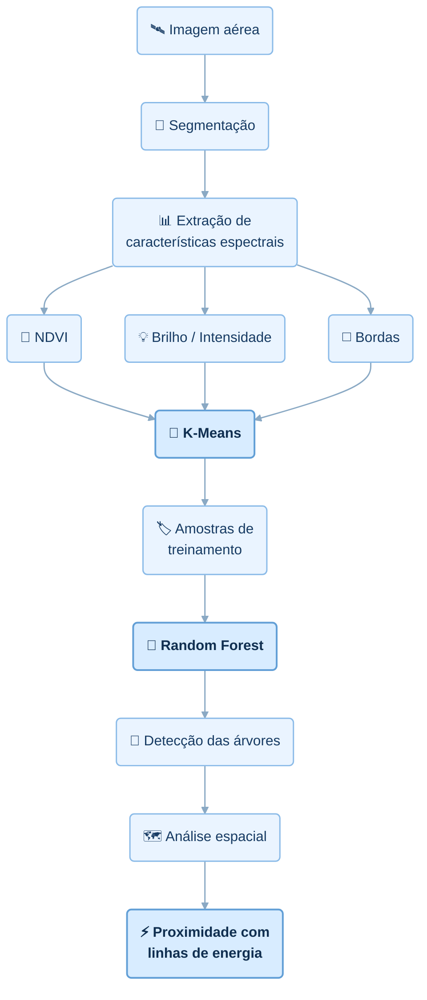

# Detecção de Árvores Urbanas em Imagens Aéreas

Projeto de mestrado dedicado à detecção e à caracterização de árvores urbanas em imagens aéreas. A abordagem combina características de brilho, bordas e Índice de Vegetação por Diferença Normalizada (NDVI) e, posteriormente, avalia a proximidade das árvores identificadas em relação às linhas de energia elétrica.

## Objetivo

Desenvolver e avaliar uma metodologia para identificar árvores urbanas a partir de dados geoespaciais e imagens aéreas, utilizando técnicas de segmentação de imagens, análise espectral e aprendizado de máquina.

## Principais etapas metodológicas

1. Segmentação de imagens baseada em objetos;
2. Extração de características espectrais;
3. Cálculo de NDVI;
4. Análise de brilho e intensidade;
5. Detecção de bordas;
6. Agrupamento não supervisionado com K-Means;
7. Classificação supervisionada com Random Forest;
8. Análise espacial das árvores detectadas;
9. Avaliação da proximidade das árvores em relação às linhas de energia.

## Fluxo metodológico



## Tecnologias e bibliotecas

- **Linguagem e ambientes:** Python, Google Colab, Google Drive e GitHub;
- **Processamento numérico e tabular:** NumPy e Pandas;
- **Análise geoespacial:** Rasterio, GeoPandas e Shapely;
- **Processamento de imagens:** scikit-image;
- **Aprendizado de máquina:** scikit-learn;
- **Visualização:** Matplotlib e Seaborn.

As dependências necessárias para executar o projeto estão registradas em [`requirements-colab.txt`](requirements-colab.txt).

## Estrutura do repositório

```text
mestrado-arvores-urbanas/
├── Segmentacao_classificacao.ipynb  # Notebook principal da metodologia
├── requirements-colab.txt           # Dependências do ambiente Google Colab
├── README.md                        # Documentação principal do projeto
├── .gitignore                       # Regras de arquivos não versionados
└── data/
    └── README.md                    # Orientações sobre os dados do projeto
```

Os arquivos geoespaciais pesados não são versionados no GitHub. Eles permanecem armazenados no Google Drive, o que evita incorporar arquivos volumosos ao histórico do repositório e mantém a organização utilizada pelo notebook.

## Organização dos dados no Google Drive

Para preservar os caminhos de dados esperados pelo projeto, organize os diretórios no Google Drive da seguinte forma:

```text
MyDrive/
└── mestrado-arvores-urbanas/
    ├── data/
    │   ├── raw/
    │   │   ├── AOI.tif
    │   │   ├── AOI_MULTI.tif
    │   │   ├── AOI.shp
    │   │   ├── Grama.shp
    │   │   ├── Arvores.shp
    │   │   ├── Linhas.shp
    │   │   └── Postes.shp
    │   └── interim/
    └── outputs/
```

- `data/raw/`: contém os dados originais de entrada;
- `data/interim/`: contém produtos intermediários gerados durante o processamento;
- `outputs/`: contém os resultados finais das análises.

> **Nota:** arquivos Shapefile normalmente são acompanhados por arquivos auxiliares, como `.dbf`, `.shx` e `.prj`. Quando disponíveis, mantenha esses componentes junto aos respectivos arquivos `.shp` em `data/raw/`.

## Execução no Google Colab

1. Faça upload dos dados para o Google Drive seguindo a estrutura indicada acima.
2. Abra [`Segmentacao_classificacao.ipynb`](Segmentacao_classificacao.ipynb) no Google Colab.
3. Monte o Google Drive na sessão do Colab quando solicitado pelo notebook.
4. Instale as dependências registradas no arquivo do projeto:

   ```python
   !pip install -r requirements-colab.txt
   ```

5. Execute as células do notebook na ordem apresentada, verificando se os arquivos de entrada estão disponíveis em `MyDrive/mestrado-arvores-urbanas/data/raw/`.
6. Consulte os produtos intermediários em `data/interim/` e os resultados finais em `outputs/`.

## Status do projeto

> **Em desenvolvimento.**

As atividades atuais estão concentradas em:

- organização e reprodutibilidade da pipeline;
- validação dos dados geoespaciais;
- aprimoramento da segmentação e classificação;
- avaliação metodológica dos resultados.

## Autor

**Breno Braga Galvão**

Projeto desenvolvido no contexto de pesquisa acadêmica de mestrado.
