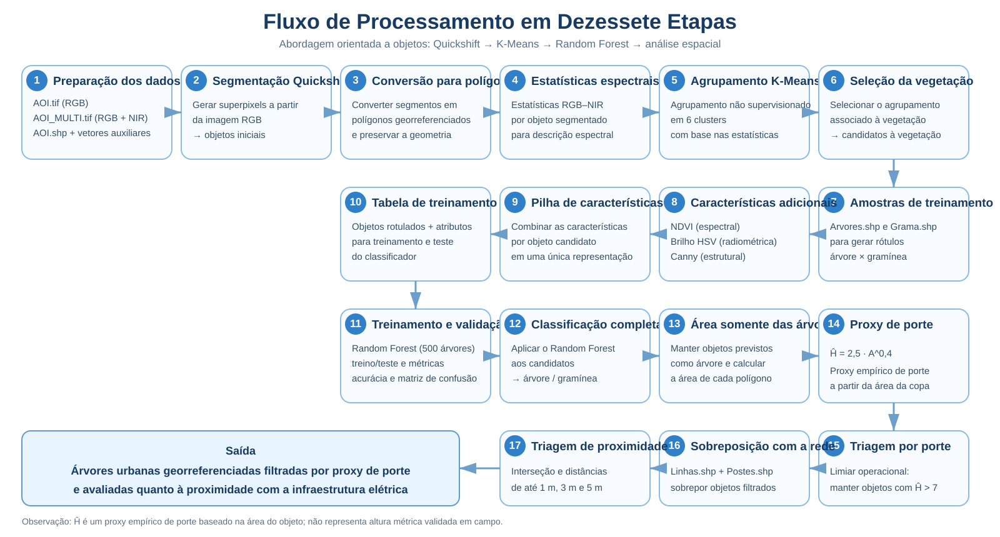

# Combinação de Características de Brilho, Bordas e NDVI para Detecção de Árvores Urbanas e Avaliação de Proximidade com Linhas de Energia

**Abordagem orientada a objetos para detecção de árvores urbanas em imagens multiespectrais de alta resolução e análise espacial de proximidade com infraestrutura elétrica.**


## Visão geral

A proximidade entre vegetação arbórea e redes de distribuição de energia pode favorecer interferências na infraestrutura, interrupções do fornecimento e riscos à segurança. O acompanhamento dessas áreas é, portanto, relevante para orientar inspeções, manejo e planejamento preventivo.

Levantamentos de campo, inspeções aéreas e aquisições LiDAR podem fornecer informações detalhadas, mas envolvem custos, logística e restrições operacionais que dificultam sua aplicação frequente em grandes áreas. Neste contexto, imagens multiespectrais de alta resolução constituem uma fonte complementar para localizar e caracterizar a vegetação urbana.

O projeto investiga uma abordagem orientada a objetos: a imagem é segmentada em regiões espacialmente coerentes e cada objeto é descrito por características espectrais, radiométricas e estruturais. Além de apoiar a discriminação entre árvores e gramíneas, essa representação conserva polígonos georreferenciados úteis à análise de proximidade com linhas de energia.

## Propostas de pesquisa

- **Proposta 1:** combinar NDVI + brilho + bordas para distinguir árvores e gramíneas.
- **Proposta 2:** localizar árvores em proximidade com a rede elétrica.

## Contribuições metodológicas

As propostas abaixo representam a **contribuição metodológica investigada** e os **elementos de originalidade da abordagem**. Sua avaliação comparativa ainda está em desenvolvimento; portanto, não se pressupõe superioridade em relação a outros métodos.

### Combinação complementar de características

A descrição dos objetos integra fontes de informação complementares:

- **NDVI:** informação espectral associada à resposta da vegetação;
- **brilho HSV:** informação radiométrica derivada da intensidade;
- **bordas de Canny:** heterogeneidade estrutural observada no interior dos objetos.

O trabalho **não propõe um novo índice espectral**. A investigação concentra-se na combinação dessas características já estabelecidas para discriminar classes de vegetação em uma unidade de análise orientada a objetos.

### Estratégia híbrida

- **K-Means:** realiza a pré-seleção não supervisionada de objetos candidatos a vegetação;
- **Random Forest:** executa a classificação supervisionada dos candidatos em **árvore** ou **gramínea**.

Essa organização busca reduzir o espaço inicial de análise antes da classificação, sem antecipar conclusões sobre ganhos de desempenho.

### Preservação da geometria

Os objetos permanecem representados como polígonos georreferenciados ao longo do fluxo. Essa estrutura permite obter ou investigar:

- área;
- proxy de porte;
- interseção;
- distância;
- proximidade com linhas de energia.

## Fluxo metodológico



*Figura — Fluxo detalhado das 17 etapas da metodologia proposta, desde a preparação dos dados e geração dos objetos até a classificação árvore–gramínea, triagem por porte e avaliação de proximidade com a infraestrutura elétrica.*

O processamento foi organizado em **17 etapas encadeadas**:

1. preparação dos dados RGB, RGB–NIR e vetoriais;
2. segmentação da imagem por **Quickshift**;
3. conversão dos segmentos em polígonos georreferenciados;
4. cálculo de estatísticas espectrais RGB–NIR por objeto;
5. agrupamento não supervisionado por **K-Means** em 6 clusters;
6. seleção do agrupamento associado à vegetação;
7. associação das amostras rotuladas de **árvores** e **gramíneas**;
8. cálculo das características adicionais: **NDVI, brilho HSV e bordas de Canny**;
9. composição da pilha de características por objeto;
10. construção da tabela de treinamento;
11. treinamento e validação do **Random Forest com 500 árvores de decisão**;
12. classificação dos candidatos em árvore ou gramínea;
13. seleção dos objetos previstos como árvore e cálculo de suas áreas;
14. cálculo do **proxy empírico de porte** a partir da área;
15. aplicação do limiar operacional de triagem;
16. sobreposição dos objetos selecionados com a infraestrutura elétrica;
17. análise de interseção e proximidade em faixas de **1 m, 3 m e 5 m**.

### Proxy de porte e limiar operacional

Após a classificação pelo Random Forest, apenas os objetos previstos como **árvore** seguem para a etapa espacial. A área de cada polígono é utilizada em uma relação potencial:

\[
\widehat{H} = 2{,}5\,A^{0{,}4}
\]

em que **A** representa a área do objeto/copa e **\(\widehat{H}\)** é utilizado como **proxy empírico de porte**.

Para a triagem espacial, foi adotado o critério operacional:

\[
\widehat{H} > 7\,m
\]

Os objetos que atendem ao critério seguem para a análise de proximidade com `Linhas.shp` e para a sobreposição com `Postes.shp`, considerando interseção e distâncias acumuladas de até **1 m, 3 m e 5 m**.

> **Importante:** \(\widehat{H}\) é empregado como um **proxy empírico de porte**, e não como uma altura métrica independentemente validada em campo. O valor de 7 m funciona como **limiar operacional de triagem** dentro do fluxo atual. A análise de proximidade é bidimensional.

## Resultados atuais

> **Resultados do experimento inicial atualmente documentado.**

| Indicador | Valor |
| --- | ---: |
| Objetos rotulados | 133 |
| Treinamento | 106 |
| Teste | 27 |
| Acurácia global | 0,81 |

| Classe | Precisão | Recall | F1-score |
| --- | ---: | ---: | ---: |
| Árvores | 0,83 | 0,77 | 0,80 |
| Gramíneas | 0,80 | 0,86 | 0,83 |

A segmentação inicial produziu **15.633 objetos**, dos quais **3.002** foram selecionados como candidatos de vegetação. Esses números descrevem apenas o experimento inicial e não devem ser interpretados como avaliação conclusiva da metodologia.

As seguintes análises estão planejadas ou em execução:

- estudo de ablação das características;
- comparação entre configurações RGB e RGB–NIR;
- comparação do Random Forest com SVM;
- validação cruzada estratificada;
- validação independente do proxy de porte;
- confirmação das contagens espaciais produzidas nas etapas de triagem e proximidade.

Nenhum resultado dessas análises é antecipado neste documento.

## Tecnologias

| Área | Tecnologias |
| --- | --- |
| Linguagem | Python |
| Execução | Google Colab |
| Rasters | Rasterio |
| Dados vetoriais | GeoPandas, Shapely |
| Processamento | NumPy, Pandas |
| Imagens | scikit-image |
| Machine Learning | scikit-learn |
| Visualização | Matplotlib, Seaborn |
| Versionamento | GitHub + Codex |
| Dados pesados | Google Drive |

As dependências do ambiente estão registradas em [`requirements-colab.txt`](requirements-colab.txt).

## Estrutura do projeto

| Item | Finalidade |
| --- | --- |
| 📓 `Segmentacao_classificacao.ipynb` | Notebook principal da metodologia |
| 🖼️ `docs/pipeline_17_etapas.svg` | Fluxo visual detalhado da metodologia |
| 📦 `requirements-colab.txt` | Dependências do ambiente |
| 📘 `README.md` | Documentação principal |
| 🚫 `.gitignore` | Arquivos não versionados |
| 📂 `data/README.md` | Orientações sobre os dados |

O **GitHub** concentra o código e a documentação versionados, enquanto o **Google Drive** armazena os dados geoespaciais pesados e os produtos do processamento. Essa separação evita incorporar arquivos volumosos ao histórico do repositório.

## Dados e armazenamento

Estrutura esperada no Google Drive:

```text
MyDrive/
└── mestrado-arvores-urbanas/
    ├── data/
    │   ├── raw/
    │   └── interim/
    └── outputs/
```

| Diretório | Finalidade |
| --- | --- |
| 📥 `data/raw/` | Dados originais |
| ⚙️ `data/interim/` | Produtos intermediários |
| 📤 `outputs/` | Resultados finais |

### Dados de entrada

| Arquivo | Função |
| --- | --- |
| `AOI.tif` | Imagem RGB |
| `AOI_MULTI.tif` | Imagem multiespectral RGB + NIR |
| `AOI.shp` | Área de interesse |
| `Arvores.shp` | Amostras de árvores |
| `Grama.shp` | Amostras de gramíneas |
| `Linhas.shp` | Linhas de energia |
| `Postes.shp` | Referência cartográfica dos postes |

> **Nota:** cada Shapefile depende de arquivos auxiliares, como `.shx`, `.dbf`, `.prj` e `.cpg`. Quando disponíveis, mantenha todos os componentes junto ao respectivo arquivo `.shp` em `data/raw/`.

## Como executar

1. Organize os dados no Google Drive conforme a estrutura indicada acima.
2. Abra [`Segmentacao_classificacao.ipynb`](Segmentacao_classificacao.ipynb), a partir do GitHub, no Google Colab.
3. Monte o Google Drive na sessão do Colab.
4. Instale as dependências:

   ```python
   !pip install -r requirements-colab.txt
   ```

5. Execute as células do notebook na ordem apresentada.
6. Verifique os produtos gerados em `data/interim/` e `outputs/`.

## Status do projeto

> **Em desenvolvimento.** A metodologia, os experimentos comparativos e a validação estão sendo aprimorados no contexto da pesquisa de mestrado.

## Autor

**Breno Braga Galvão**

Projeto desenvolvido no contexto de pesquisa acadêmica de mestrado.
